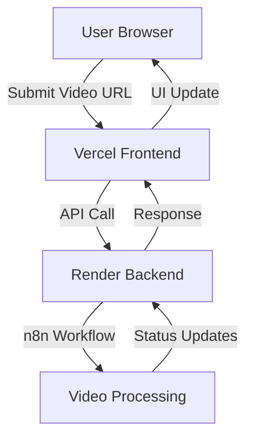

# 🚀 Cloud Deployment Guide

This guide covers deploying the AI Video Repurposing Pipeline to the cloud using **Render.com** (backend) and **Vercel** (frontend).

## 🏗️ Architecture Overview

```
Frontend (Vercel) ↔ Backend API (Render.com)
     ↓                      ↓
Static Hosting       Docker Container
(Global CDN)        (n8n + Dependencies)
```

## 📋 Prerequisites

- GitHub account
- Render.com account (free tier available)
- Vercel account (free tier available)
- OpenAI API key

## 🔧 Backend Deployment (Render.com)

### Step 1: Prepare Repository

```bash
# Initialize git and add files
git add .
git commit -m "Initial commit: AI Video Repurposing Pipeline"

# Create GitHub repository and push
git remote add origin https://github.com/yourusername/n8n-video-repurposing.git
git push -u origin main
```

### Step 2: Deploy to Render

1. **Go to [Render Dashboard](https://dashboard.render.com)**
2. **Click "New +" → "Web Service"**
3. **Connect your GitHub repository**
4. **Configure the service:**
   - **Name**: `n8n-video-repurposing`
   - **Environment**: `Docker`
   - **Region**: Choose closest to your users
   - **Branch**: `main`
   - **Dockerfile Path**: `./Dockerfile.render`

### Step 3: Environment Variables

Add these environment variables in Render:

```bash
# Required Variables
N8N_USER=your-admin-username
N8N_PASSWORD=your-secure-password-here
N8N_ENCRYPTION_KEY=your-32-character-encryption-key-here
OPENAI_API_KEY=sk-your-openai-api-key

# Auto-configured by Render
N8N_HOST=0.0.0.0
N8N_PORT=5678
N8N_PROTOCOL=https
WEBHOOK_URL=https://your-app-name.onrender.com
```

### Step 4: Configure Persistent Storage

1. In Render dashboard, go to your service
2. Navigate to "Disks" tab
3. Add a disk:
   - **Name**: `n8n-data`
   - **Mount Path**: `/home/node/.n8n`
   - **Size**: `5GB` (or more based on needs)

## 🌐 Frontend Deployment (Vercel)

### Step 1: Prepare Frontend Repository

```bash
cd frontend
git add .
git commit -m "Initial commit: Frontend interface"

# Create separate GitHub repository for frontend
git remote add origin https://github.com/yourusername/video-repurposing-frontend.git
git push -u origin main
```

### Step 2: Deploy to Vercel

1. **Go to [Vercel Dashboard](https://vercel.com/dashboard)**
2. **Click "Add New..." → "Project"**
3. **Import your frontend repository**
4. **Configure build settings:**
   - **Framework Preset**: `Next.js`
   - **Build Command**: `npm run build`
   - **Output Directory**: `.next` (auto-detected)

### Step 3: Environment Variables

Add these in Vercel's environment variables:

```bash
NEXT_PUBLIC_N8N_API_URL=https://your-render-app.onrender.com/api/v1
NEXT_PUBLIC_WORKFLOW_ID=get-this-from-n8n-after-import
NEXT_PUBLIC_N8N_API_KEY=your-n8n-api-key
```

## 🔗 Backend-Frontend Connection

### How They Connect:

1. **Frontend (Vercel)** makes HTTP requests to **Backend (Render)**
2. **API calls** go from browser → Vercel edge → Render.com
3. **CORS** is configured in the n8n setup to allow cross-origin requests
4. **Authentication** via API keys and basic auth

### Connection Flow:



## ⚙️ Configuration Steps

### 1. Get n8n Workflow ID

After deployment:

```bash
# Access your n8n instance
curl -u "username:password" https://your-app.onrender.com/api/v1/workflows
```

Or via the n8n UI:
1. Go to `https://your-app.onrender.com`
2. Import `name_AI_Video_Repurposing_2.json`
3. Note the workflow ID from the URL

### 2. Configure OpenAI in Workflow

1. Open n8n interface
2. Edit nodes 5 & 6 (Whisper & GPT-4)
3. Add your OpenAI API credentials
4. Save and test the workflow

### 3. Update Frontend Environment

```bash
# In Vercel dashboard, update:
NEXT_PUBLIC_WORKFLOW_ID=actual-workflow-id-from-n8n
```

## 🔐 Security Configuration

### Backend Security (Render):
```bash
# Enable these in environment variables
N8N_BASIC_AUTH_ACTIVE=true
N8N_BASIC_AUTH_USER=your-username
N8N_BASIC_AUTH_PASSWORD=your-password
```

### Frontend Security (Vercel):
- API keys are exposed to client (use with caution)
- Consider implementing backend proxy for sensitive operations
- Enable Vercel's security headers

## 📊 Monitoring & Scaling

### Render Monitoring:
- Built-in metrics dashboard
- Log streaming
- Health checks configured
- Auto-restart on failure

### Vercel Monitoring:
- Analytics dashboard
- Function logs
- Performance insights
- Global CDN metrics

### Scaling Considerations:
- **Render**: Upgrade plan for more CPU/RAM
- **Vercel**: Automatic scaling for frontend
- **Storage**: Increase disk size for more videos

## 💰 Cost Estimation

### Free Tier Limits:
- **Render**: 750 hours/month, shared CPU
- **Vercel**: 100GB bandwidth, unlimited requests

### Paid Plans:
- **Render Starter**: $7/month (512MB RAM, 0.5 CPU)
- **Render Standard**: $25/month (2GB RAM, 1 CPU)
- **Vercel Pro**: $20/month (improved limits)

## 🐛 Troubleshooting

### Common Issues:

#### Backend Won't Start:
```bash
# Check Render logs
curl https://your-app.onrender.com/healthz

# Common fixes:
- Verify environment variables
- Check Docker build logs
- Ensure sufficient disk space
```

#### Frontend Can't Connect:
```bash
# Verify CORS configuration
# Check API endpoint URLs
# Validate environment variables
```

#### Video Processing Fails:
```bash
# Check n8n workflow logs
# Verify OpenAI API key
# Ensure sufficient storage space
```

## 🚀 Going Live Checklist

- [ ] Backend deployed and healthy on Render
- [ ] Frontend deployed and accessible on Vercel  
- [ ] Environment variables configured
- [ ] n8n workflow imported and tested
- [ ] OpenAI credentials configured
- [ ] CORS properly configured
- [ ] Domain configured (optional)
- [ ] SSL certificates active
- [ ] Monitoring setup
- [ ] Backup strategy planned

## 🔄 Updates & Maintenance

### Backend Updates:
```bash
git push origin main  # Triggers auto-deploy on Render
```

### Frontend Updates:
```bash
git push origin main  # Triggers auto-deploy on Vercel
```

### Health Monitoring:
- Set up uptime monitoring (UptimeRobot, etc.)
- Configure alerts for failures
- Regular backup of n8n data

---

**🎉 You're now ready to process videos in the cloud!** 